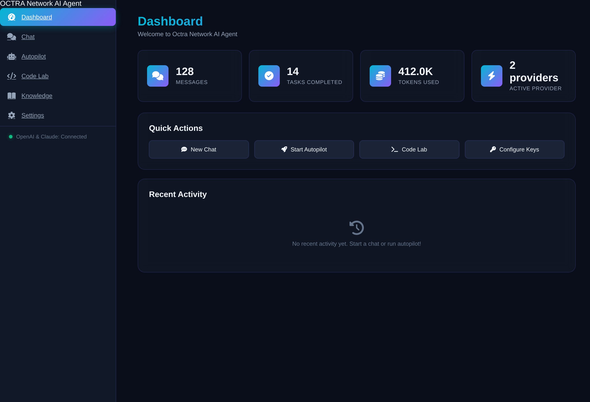
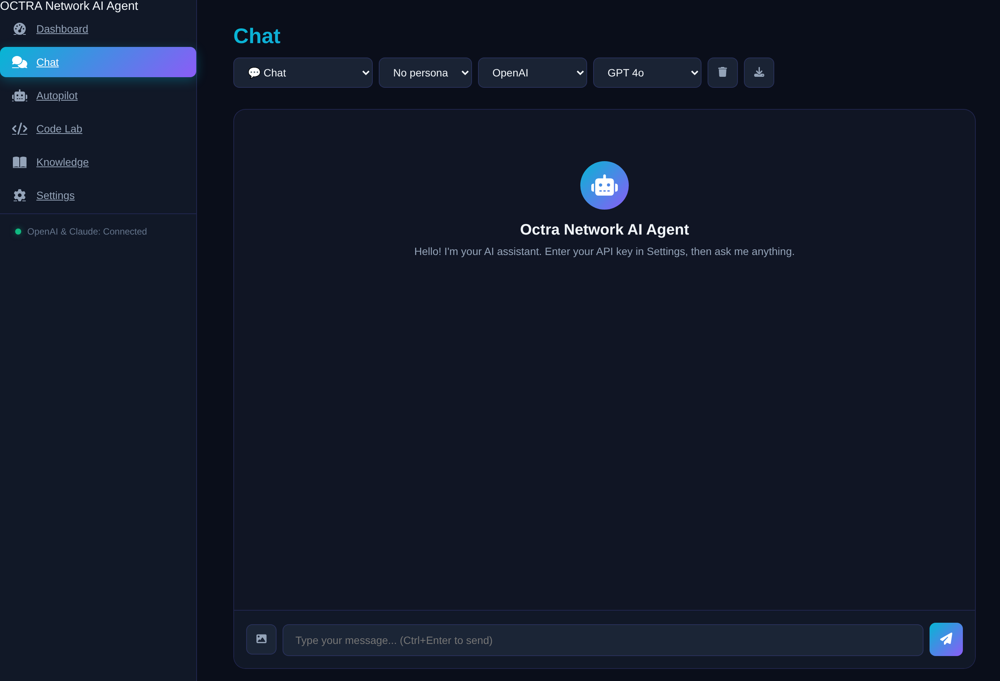
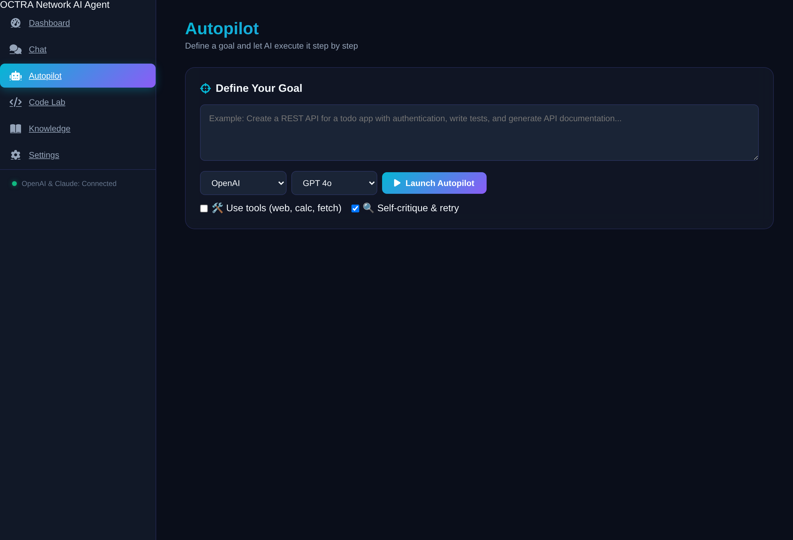
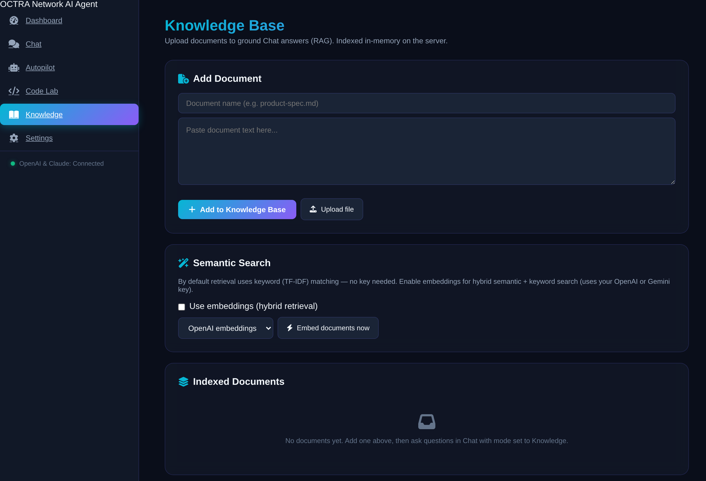
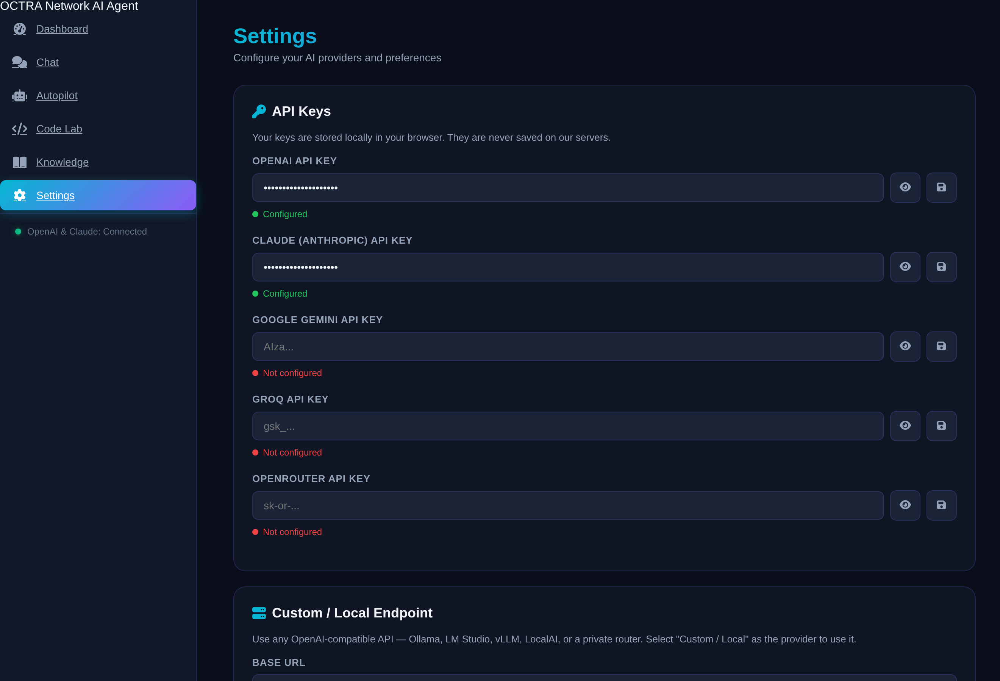

# 🤖 Octra Network AI Agent


An advanced, multi-provider AI agent platform: **MCP tool servers**, agentic tool use, vision, hybrid RAG, a multi-agent autopilot, personas, conversation memory, and cost-aware model routing — in one lightweight, zero-infra app. Bring your own API keys — nothing stored server-side.


## ✨ Features

- **6 Providers** — OpenAI, Claude, Gemini, Groq, OpenRouter, plus **any OpenAI-compatible / local endpoint** (Ollama, LM Studio, vLLM) — one unified adapter
- **MCP client** — connect Model Context Protocol servers (Streamable HTTP) and use their tools in the agent; no longer limited to built-ins
- **Agentic Tool Use** — a provider-agnostic ReAct loop with safe built-ins: web search, URL fetch (SSRF-guarded), sandboxed calculator, datetime — plus any MCP tool
- **Vision** — attach images in chat; formatted correctly for OpenAI, Claude, and Gemini
- **Hybrid RAG** — upload documents; optional embeddings (OpenAI/Gemini) blended with TF-IDF for semantic + keyword retrieval with citations. Zero-key TF-IDF default
- **Multi-Agent Autopilot** — plan → execute → self-critique → retry, optional tools, one-shot replanning, hard token budget
- **Personas** — reusable system-prompt + model presets, applied from the chat header
- **Conversation Memory** — persistent history, branching, read-only share links
- **Cost-Aware Routing** — auto-pick the cheapest/fastest/best model from your configured providers, with automatic fallback
- **Code Lab** — AI-powered code generation, analysis, refactoring, explanation
- **Streaming** everywhere · **token + cost** transparency · **Helmet/CORS/rate-limit** security · keys **client-side only**
- **Single source of truth** — standalone server and serverless build share one app factory

See [COMPARISON.md](COMPARISON.md) for how octra stacks up against the top GitHub AI tools.

## 📸 Screenshots

| Dashboard | Chat (chat / agent / knowledge modes) |
|---|---|
|  |  |
| **Autopilot** (multi-agent) | **Knowledge** (RAG + hybrid search) |
|  |  |
| **Settings** (6 providers · custom/local · MCP · personas) | |
|  | |

## 🚀 Quick Start

### Local

```bash
git clone https://github.com/0xgetz/octra-ai-agent
cd octra-ai-agent
cp .env.example .env
npm install
npm start
```

Open http://localhost:3000

### Docker

```bash
docker build -t octra-ai-agent .
docker run -p 3000:3000 octra-ai-agent
```

### Development

```bash
npm run dev   # auto-reload with --watch
```

## ⚙️ Environment Variables

Copy `.env.example` to `.env` and set:

| Variable | Default | Description |
|----------|---------|-------------|
| `PORT` | `3000` | Server port |
| `CORS_ORIGINS` | `http://localhost:3000,http://127.0.0.1:3000` | Allowed CORS origins (comma-separated; `*` allows all) |
| `PERSIST_DIR` | _(unset)_ | Directory for durable conversation/share storage. In-memory if unset. |

## 🔑 API Keys

- **OpenAI**: https://platform.openai.com/api-keys
- **Claude**: https://console.anthropic.com/settings/keys
- **Gemini**: https://aistudio.google.com/app/apikey
- **Groq**: https://console.groq.com/keys
- **OpenRouter**: https://openrouter.ai/keys
- **Custom / Local**: no key needed for Ollama/LM Studio — set the base URL in Settings (e.g. `http://localhost:11434/v1`)

## 📡 API Reference

| Method | Endpoint | Description |
|--------|----------|-------------|
| GET | `/api/health` | Health check |
| GET | `/api/models` | Available models + provider metadata |
| GET | `/api/tools` | List agentic tools |
| POST | `/api/route` | Cost/speed-aware model recommendation |
| POST | `/api/chat` | Single chat completion (non-streaming) |
| POST | `/api/chat/stream` | SSE streaming chat completion |
| POST | `/api/agent` | Agentic tool-use loop (SSE streaming) |
| POST | `/api/autopilot` | Multi-agent goal execution (SSE streaming) |
| POST | `/api/autopilot/stop` | Cancel an active autopilot run |
| POST | `/api/analyze` | Code analysis/generation |
| POST | `/api/rag/documents` · GET · DELETE | Manage knowledge-base documents |
| POST | `/api/rag/search` | Retrieve top chunks for a query |
| POST | `/api/rag/embed` | Build embeddings for hybrid retrieval |
| POST | `/api/rag/chat` | Chat grounded in uploaded documents (lexical or hybrid) |
| POST | `/api/mcp/connect` · GET `/api/mcp/servers` · DELETE | Manage MCP tool servers |
| GET/POST | `/api/personas` · GET/PATCH/DELETE `/api/personas/:id` | Manage personas / custom assistants |
| GET/POST | `/api/conversations` | List / create conversations |
| GET/PATCH/DELETE | `/api/conversations/:id` | Read / rename / delete a conversation |
| POST | `/api/conversations/:id/messages` | Append a message |
| POST | `/api/conversations/:id/branch` | Fork from a message |
| POST | `/api/conversations/:id/share` | Create a read-only share link |
| GET/DELETE | `/api/share/:shareId` | View / revoke a shared conversation |

### POST /api/chat

```json
{
  "provider": "openai",
  "apiKey": "sk-...",
  "model": "gpt-4o",
  "messages": [{ "role": "user", "content": "Hello!" }],
  "temperature": 0.7,
  "maxTokens": 2048
}
```

**Vision** — add an `images` array (data URLs or http(s) URLs) to any message:

```json
{ "role": "user", "content": "What's in this image?", "images": ["data:image/png;base64,..."] }
```

**Local / custom model** — use the `custom` provider with a `baseURL`:

```json
{ "provider": "custom", "baseURL": "http://localhost:11434/v1", "model": "llama3.1",
  "messages": [{ "role": "user", "content": "Hi" }] }
```

**MCP** — register a tool server, then run the agent (its tools are auto-injected):

```bash
curl -X POST localhost:3000/api/mcp/connect -H 'content-type: application/json' \
  -d '{"url":"https://your-mcp-server/mcp"}'
```

## 🏗 Architecture

- **Backend**: Node.js 18+ (ESM), Express, Helmet, express-rate-limit
- **Shared core** (`lib/`): `app-factory.js` (routes), `providers.js` (6-provider
  adapter + embeddings, routing & fallback), `tools.js` (ReAct loop + safe tools),
  `mcp.js` (MCP client), `rag.js` (TF-IDF + hybrid retrieval), `agent.js`
  (multi-agent autopilot), `memory.js` (conversations, branching, share, personas),
  `validation.js`
- **Entrypoints**: `server.js` (standalone) and `api/index.js` (serverless) both
  build their app from the same factory
- **Frontend**: Vanilla JS, CSS3 glassmorphism; selectors hydrate from `/api/models`
- **Persistence**: In-memory by default; set `PERSIST_DIR` for durable conversations

## 🧪 Quality

```bash
npm run lint   # ESLint v10 flat config — 0 errors
npm test       # 62 unit + integration tests (node:test), no API keys needed
```

## 🤝 Contributing

PRs welcome! Please open an issue first for major changes.

## 📄 License

MIT
